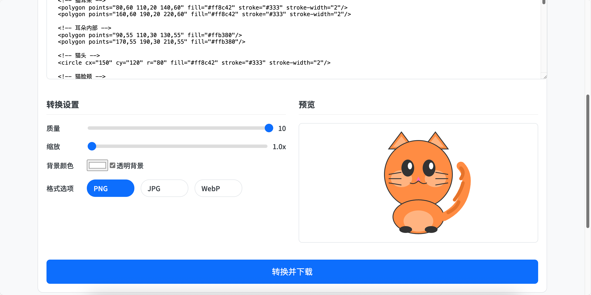

# Web Tools Suite 网页工具集

一个实用的网页工具集合，提供多种常用的在线工具功能。

## 🌟 特性

- 💡 简洁现代的界面设计
- 🚀 快速的本地处理能力
- 📱 响应式布局，支持移动端
- 🛠 多种实用工具集成

## 🔧 工具列表

### 1. SVG 转换器
- 支持 SVG 转 PNG/JPG 格式
- 可调节输出图片质量
- 支持自定义背景颜色
- 支持图片缩放

### 2. 代码格式化工具
- 支持多种编程语言
- 实时预览
- 可自定义缩进规则

### 3. JSON 编辑器
- 树形结构展示
- 语法错误检查
- 格式化输出

## 📸 效果展示

### SVG 转换器界面


### 代码格式化工具


### JSON 编辑器


## 🚀 快速开始

1. 克隆仓库
```bash
git clone https://github.com/xianyu110/web-tools-suite.git
```

2. 进入项目目录
```bash
cd web-tools-suite
```

3. 直接在浏览器中打开 `index.html` 文件即可开始使用。

## 🌐 在线访问

项目已通过 GitHub Pages 部署，你可以通过以下链接访问：

**[https://xianyu110.github.io/web-tools-suite/](https://xianyu110.github.io/web-tools-suite/)**

## 🤝 贡献

欢迎提交 Issue 和 Pull Request！ 